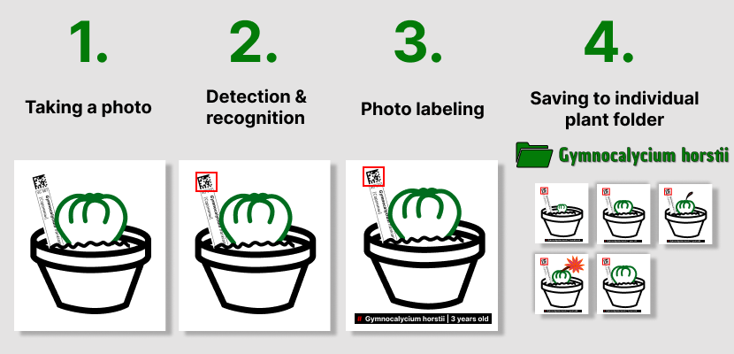

EN | [RU](readme_ru.md)

# Data Matrix File Sorter and Image Labeler

Automatic **recognition** the plants on the photos by the label with a 2D-code (Data Matrix), photos of plants **organizing** and **marking** it wiht plant information: genus, species, age, etc. Useful tool for botanists and plants collectors.

- [Intro](#intro) 
- [Description](#description)
- [The logic of the app](#the-logic-of-the-app)
- [Data Sources](#data-sources) 
  - [Photo sources](#photo-sources)
  - [Reference information source](#reference-information-source)
    - [CSV-file](#csv-file)
    - [XLSX-file](#xlsx-file)
- [Detection and recognition](#detection-and-recognition)
- [Photo files organizing](#photo-files-organizing)
- [Reusult examples](#result-examples)
- [Creating labels](#creating-labels)
- [FAQ](#creating-phisical-labels)

## Intro

*This is a non-commercial opensource project. The author of this project is a succulent growing enthusiast who dreams about automating routine processes of accounting and systematization of plant information, making life of collectors easier and popularizing **peaceful** hobby of growing plants, especially mesembs (Aizoaceae).*

## Description

If you are a botanist, a plants collector or a grower enthusiast, your mobile phone and the computer hard drive are almost certainly full of thousands of photos of plants. This is understandable, because you take photos not only in special moments in plants life like flowering, but also just regulary, to track the development of the plant. And all attempts to organize this bunch of photos are usual unsuccessful. 

The other laborious task is to keep information about plants. Plastic labels with basic information and excel-file (or barn notebook) are traditional tools. Maintaining of such accounting system requires a lot of work and has high risks of human factor mistakes.

Automatically recognizible labels can help to solve both of this tasks. [Data Matrix](https://en.wikipedia.org/wiki/Data_Matrix) is like a QR-Code, but smaller and containts just a unique number of plant. A label with Data Matrix is easy to **DIY** - print, cut and laminate for all your plants at once. The benefits of such labels: 
- recognition automation of plant or multiple plants on the photo;
- automatically marking of the photos with plant information (name, age, seed source, etc.);
- automatically plants photos organizing between particular plant folder;
- neat and organized look because of same label size;
- identification reliability: it can also contain *human-readable* information as a backup;
- labels making automation. 

## The logic of the app

The following steps are proposed: 

1. The plant lover take photos of plants he/she owning as mach as he/she wants. 
2. The app analyse all this photos and try to find a data matrix and recoqnize the plant.
3. The name, age, etc. of plant is put on photo.
4. The resulting photo is saving to the individual folder of particular plant.

After some time new photos will be collected and the cycle can be repeted. As a result the plant lover will have all his photos of his/her plants organized in fully automatically way with information label on each photo. 

More detailed algorithm is shown on the [logic scheme](img/logic_scheme.png).

## Data sources

There are two types of input data: 
- photos of plants;
- reference information like genus, species, seeding date, etc.

### Photo sources

In current version you can provide photos of your plants in three ways: 
1. Put photos to `INPUT` folder in root dir. The app will process them and depending on the result move files to `Successful` or `Unsuccessful` subfolder. 
2. Add path (or multiple paths) of the location where your photos are stored to the `input_paths.txt` file. The app will process all image files in this locations and in subfolders recursively in *read_only* mode. 
3. Photos of plants without or undecoded data-matrix label can be manually put to the particular plant's folder `LABEL_REQURED` subfolder. Such photos will be also processed according and marked with label according to the plant folder. 

### Reference information source

- In current version reference information can be extracted from csv-file. It can be easy created from the list of plants in Excel which you probably have.
- There are plans to make an possibillity to read info from cloud-stored spreadsheet, like Google Spreadsheet. 

#### CSV-file

The main csv-file requirements  are: 
- correct column names in first line;
- filled UID column.

There are multiple inconveniences by editing csv-file, for example: during file opening type of UID column should be choosen as 'text', otherwise as 'number' by default the UID values with zero at the first place will loose it, wich means UID will be modified by opening, wich is unacceptable. Considering this csv format is using as temporary.

#### XLSX-file

Local XLSX-file, XMLX-file in the cloud or online spreadsheet (like Goolge Spreadsheet) support will be added as soon as possible.

## Detection and recognition

There are three possible cases with detection and recognition:
1. The photo has Data Matrix wich was detected and plant recignized successfully
2. The photo has Data Matrix but for some reason it was not detected or recognized or was recognized wrong or recogized correctly, but not found in data base. 
3. The photo doesn't have any Data Matrix, so recognition is possible. 

Photos from cases 2 and 3, if you can identify plant on it, can be manually places to the required plant folder `LABEL_REQURED` subfolder.  See [Photo Sources](#photo-sources) section.

## Photo files organizing
The first step after app runnig is to create or update output folder structure. The output folder structure matches the database (reference file) structure exactly and represents inividual folder for each plant. The Name of individula plant folder containts UID and plant name (genus, species, etc.). If you manually delete some plant folder or delete the output folder structure completely, it will be recreated after next app lounch. 

Each plant folder also has a subfolder with name `LABEL_REQURED` for labeling manual recognised plants photos. 

## Result examples

- Resulting photo of manually recognized plant:  

    

- Resulting photo of two autmatically recognized plants:  

    

- Resulting photo of multiple autmatically recognized plants:  

    

## Creating labels
A PDF file with labels can be generated according to the reference file. The next steps for creating smart and durable physical labels are: 
- cut out each paper label; 
- laminate it using as thicker laminating film as you can get;
- leave at least 2 mm gap between paper labels (for insulation of paper);
- cut out each laminated label;
- make oblique cut of the side of lable wich will be put into the soil. 

PDF-generator is not implemented in this repo yet, but it's ready and it will be here soon. 

## FAQ

### Q: Is it works on Windows / Mac?
As all code is python, theoretically - yes. But more likely some refactoring is needed for crossplatform support. If you Windows / Mac user, you can contribute as a tester.

### Q: What code encoded in Data Matrix? 
Only UID - a unque identifier - 6 (or more) digits number. All other plant infromation is retrieved from reference file by UID. 

### Q: Where to get a model for a neural network?
Ask me. It's not a secret, it's just too big to store it in GitHub.
