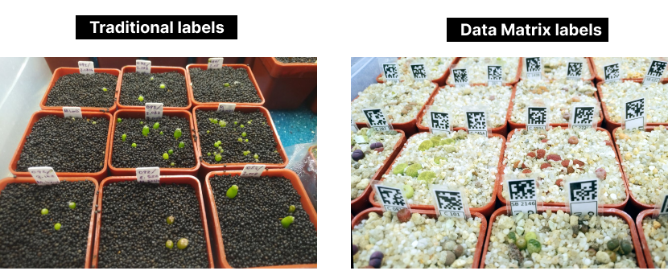
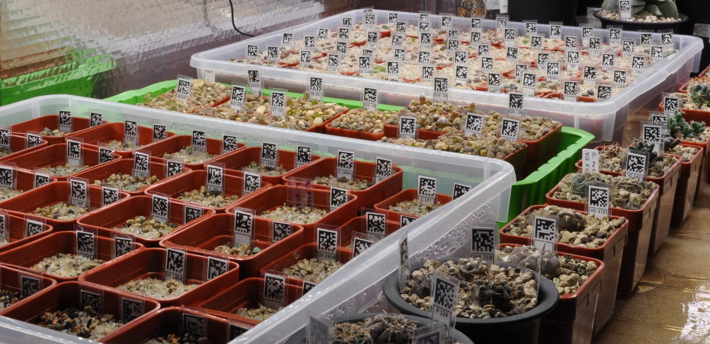
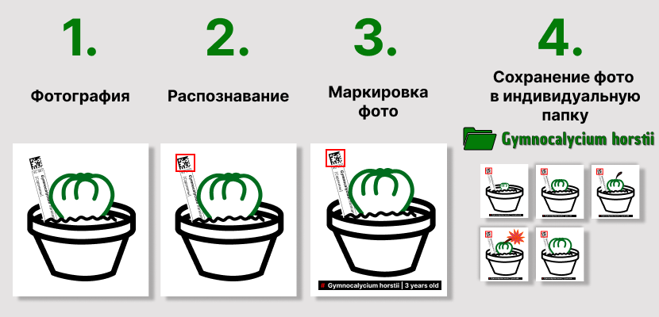
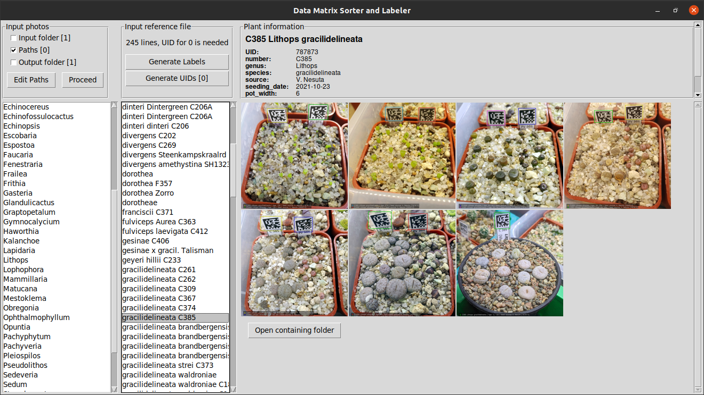
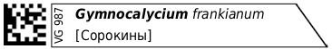

[EN](README.md) | RU

# Сортировщик и маркирователь фотографий по матричному коду

Автоматическое **распознавание** растений на фотографии по двухмерному коду (Дата Матрице), **организация** фотографий растений, а также **маркирование**  фотографий информацией о данном растении: род, вид, возраст и т.д.  Удобный инструмент для ботаников и коллекционеров растений. 

- [Введение](#введение) 
- [Описание](#описание)
- [Логика приложения](#логика-приложения)
- [Источники данных](#источники-данных) 
  - [Источники фотографий](#источники-фотографий)
  - [Источник справочной информации](#источник-справочной-информации)
    - [CSV-файл](#csv-файл)
    - [XLSX-файл](#xlsx-файл)
- [Детектирование и декодирование](#детектирование-и-декодирование)
- [Организация файлов фотографий](#организация-файлов-фотографий)
- [Интерфейс программы](#интерфейс-программы)
- [Примеры результатов](#примеры-результатов)
- [Создание меток](#создание-меток)
- [FAQ](#faq)

## Введение

*Это некоммерческий проект с открытым исходным кодом. Автор этого проекта является любителем в выращивании суккулентов и мечтает об автоматизации рутинных процессов учета и систематизации информации о растениях, чтобы облегчить жизнь, а также популяризировать **мирное** хобби по выращиванию растений, в особенности мезембов (Аизовых)*

## Описание

Если вы изучаете или коллекционируете растения или просто являетесь любителем-энтузиастом, то почти наверняка ваш телефон и жесткий диск компьютера содержат тысячи фотографий растений. Это понятно, потому что вы фотографируете растения не только в особые моменты его жизни, например в период цветения, но и просто так, на регулярной освное, чтобы отслеживать развитие данного растения. И все попытки организовать эту кучу фотографий обычно заканчиваются неудачно. 

Другой трудемкой задачей является хранении информации о растении. Пластиковая табличка с минимальной информацей и excel-файл (или амбарная книга) - традиционно используемые инструменты. Поддержка такой системы учета требует много сил, при этом большие риски, связанными с человеческим фактором. 

Автоматически распознаваемые таблички могут помочь решить обе эти проблемы. [Дата Матрица](https://en.wikipedia.org/wiki/Data_Matrix) - это как QR-код, только меньше по размеру, который содрежит только уникальный номер растения. Табличку с Дата Матрицей очень просто сделать самостоятельно: распечтать, вырезать и заламинировать, один раз для всех ваших растений. Преимущества таких табличек:

- автоматическое распознавание растения или нескольких растений на фотографии;
- автоматическая маркировка фотографий информацией об изображенном растении (имя, возраст, источник семян и т.д.);
- автоматическая организация фотографий в индивидуальные папки растений;
- благодаря однотипности и одинаковому размеру бирок - аккуратный и организованный внешний вид вашей коллекции;
- точность идентификации: бирка может также содержать в себе информацию в человеко-понятном виде;
- автомтизация изготовления бирок.

## Логика приложения

Предлагаются следующие шаги: 

1. Пользователь (любитель растени) делает столько фотографий, сколько он хочет.
2. Приложение анализирует все эти фотографии, пытаясь найти на них Дата Матрицу и распознать расетние. 
3. Имя растения, возраст и др. информация наносится на изображенрие фотографии. 
4. Обновленный файл фотографии сохраняется в индивидуальную папку данного растения. 
  

По прошествию какого-то количества времени накопятся новые фотографии и цикл повторится. В результате пользователь получит все свои фотографии, маркированные и организованные в отдельные папки полностью автоматически. 

Более детальны алгоритм работе представлен на  [логической схеме](img/logic_scheme.png).

## Источники данных

Приложение использует два вида входных данных: 
- изображение - фотографий растений;
- текст - справочная информация о растениях: род, вид, дата посева и т.д.

### Источники фотографий

В текущей версии фотографии могут быть доставлены в приложение тремя способами: 
1. Расположить файлы фотографий в папку `INPUT` в корневой директории приложений. Приложение их проанализирует (попытается распознать растения на фото) и, в зависимости от результата, переместит файлы в папку `Successful` или `Unsuccessful`.
2. Добавить путь (или несколько путей) к директории с фотографиями в файл `input_paths.txt`. Приложение проанализирует все фотографии по указанным путям в режиме *только чтение*. 
3. Фото растений, не имеющих матриц данных либо имеющих, но не декодированных, могут вручную помещены непосредственно в папку нужного растения, подпапку `LABEL_REQURED`. Такие фотографии будут также обработаны, т.е. на них будут нанесена информация о тех растениях, в папку которых они были размещены. 

### Источник справочной информации

- В текущей версии справочная информация может быть получена из csv-файла. Которые в свою очередь может быть легко получен из таблицы Excel, наверняка у вас уже имеющейся. 
- В плане разработки также стоит возможность получать информацию из облачных офисных приложены, таких как Google Spreadsheet.

#### CSV-файл

Основные требования к csv-файлу:
- корректные имена заголовков в первой строке;
- заполненный столбец UID (могут быть сгенерированы автоматически).

Использование таких простых форматов (а не использование баз данных, например) позволяет получить данные как через приложение, так и стандартными средствами (текстовый редактор, редактор электорнных таблиц). Тем не менее, есть много неудобств при редактировании csv-файла. Вероятно, использование данного формата носит временный характер.

#### XLSX-файл

Локальный XLSX-файл, онлайн таблица (например, Goolge Spreadsheet) будут поддерживаться в следующих релизах.

## Детектирование и декодирование

Существует три вероятных сценария, связанных с обнаружением матрицы данных и ее декодированием: 
1. Фото имеет матрицу данных, которая была успешно обнаружена и декодирована.
2. Фото имеет матрицу данных, но по каким-то причинам она не была обнаружена или декодированиа или была обнаружена но не была декодирована или была обнаружена и декодирована, но данный не были найдены в базе данных. 
3. Фото не имеет матрицу данных. 

Для случаем 2 и 3 возможно ручное размещение фотографии в папке требуемого растения подпапке `LABEL_REQURED`.  См. пункт [Источники фотографий](#источники-фотографий).

## Организация файлов фотографий
Первым этапом после запуска приложения явлется актуализация (или создание, если запуск выполняется впервые) папочной структуры. Выходная папочная структура в точности соответствует структуре [базы данных](#источник-справочной-информации) и содержит индивидуальную директорию для каждого растения. Имя папки содержит UID и имя растения (род, вид и т.д.). Если вы случайно удалите папку какого-то растения или всю структуру, то они будут вновь созданы при следующем запуске (но не их содержимое!). 

Папка каждого растения также содержит подпапку с именем `LABEL_REQURED`, в которую можно поместить вручную распознанные фотографии для нанесения лейбла. 

## Интерфейс программы 

Вот пример, как выглядит главное окно программы: 
 

## Примеры результатов

- Результирующее фото вручную распознанного растения:  

    

- Результирующее фото автоматически распознанного растения:  

    

- Результирующее фото с несколькими растениями, распознанными автоматически:  

    

## Создание меток
PDF-макет с метками может быть сгенерирован для последующей печати и ламинации. Следующие шаги описывают технологию ручного изготовления износоусточивых меток:
- распечатать PDF-файл;
- вырезать метки; 
- заламинировать метки используя настолько толстую ламинирующую плёнку, какую только можно купить;
- ламинируя следует оставлять минимальный зазор 2-4 мм между метками, чтобы обеспечить герметичность;
- вырезать заламинированные метки;
- сделать косой срез со стороны, которая будет втыкаться в субстрат.  

Генератор макета уже внедрен в текущий релиз. 

## FAQ

### Q: Будет ли это на Windows / Mac?
Т.к. всё написано на python, то теоретически - да. Но с большой долей вероятности для кроссплатформенной работы потребуется какой-то рефакторинг. Если вы являетесь пользователем Windows / Mac, вы может поучаствовать в проекте, хотя бы как тестировщик. 

### Q: Какой код содержит матрица данных на метках? 
Только UID - уникальный идентификатор, состоящий из 6 (или более) цифр. Вся остальная информация получается из [базы данных](#источник-справочной-информации) по UID. 

### Q: Где взять модель для нейросети?
Просто попросите меня любым способом. Она не секретная, просто слишком объемная, чтобы хранить ее на GitHub.

